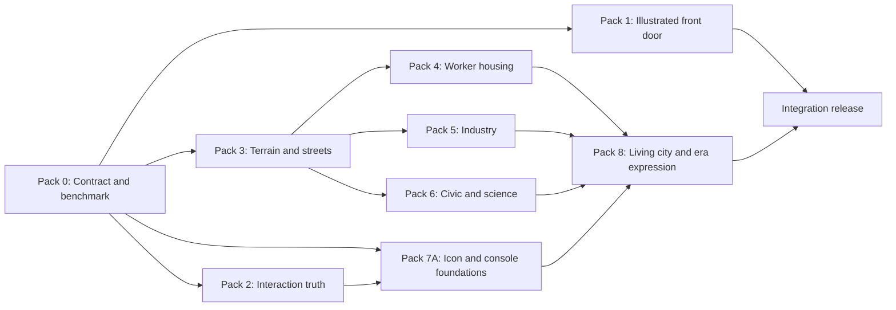

# GOSPLAN Graphics Implementation Plan

Date: 2026-07-10

Status: Phase 1 implemented and under adversarial closure; later art packs remain planned

Execution source of truth: this document

Creative source of truth: `docs/GRAPHICS_REVIEW_AND_ROADMAP_2026-07-10.md`

Visual references:

- `docs/graphics-review/proposed-city-north-star.png`
- `docs/graphics-review/proposed-building-environment-board.png`
- `docs/graphics-review/proposed-loading-screen.png`

## Current execution boundary

This plan describes the complete graphics program. The 2026-07-10 implementation tranche is Phase 1, not the completed program.

| Pack | Current state | Evidence and remaining boundary |
|---|---|---|
| Pack 0: Contract and benchmark | Foundation implemented | Typed manifest, deterministic variant resolver, runtime fallback, validators, CI gates, backup runbook, provenance ledger, and evidence index are present. Full performance thresholds and the complete benchmark capture matrix remain open. |
| Pack 1: Illustrated front door | Phase 1 accepted | Opening, title, three scenario vignettes, three loading modes, pause dossier, event decree, and campaign-ending styling share the desk-and-dossier world. The complete later release capture matrix remains open. |
| Pack 2: Interaction truth | Phase 1 accepted | Authoritative tool snapshots, footprint previews, semantic overlays, minimap refresh, locked-category traversal, modal shortcut suppression, drag cancelation, compatibility undo, and elevation-network guards are implemented and covered by the interaction harness. |
| Pack 3: Physical terrain and streets | Elevation prototype accepted | Deterministic elevation generation, save compatibility, height-aware picking, shared cross-renderer depth, material-aware procedural cliffs, and network height rules exist. Authored slopes, roads, shoreline transitions, retaining walls, and the final terrain atlas are not complete. |
| Packs 4 to 8 | Planned, not implemented | Worker housing, industry, civic/science families, Ministry Console, living-city animation, era expression, and complete release evidence remain future delivery packs. |

Approved claim: **Phase 1 graphics foundation, illustrated front door, interaction truth, and elevation prototype.**

Do not describe the game-wide graphics program as complete until every completion gate in this document passes.

## 1. Objective

Implement the approved visual direction as a maintainable game-art system, not a sequence of disconnected polish passes.

The program is complete when:

- the playable city has physical terrain, coherent districts, and authored building families
- menus and loading screens share one illustrated Soviet pixel-art language
- every visual state accurately reflects game and interaction state
- authored assets use one documented manifest and deterministic selection path
- procedural art remains a safe fallback
- zoom level and graphics quality degrade detail without losing gameplay meaning
- every release pack has reproducible visual proof, automated checks, and a rollback path

## 2. Non-negotiable implementation rules

1. **No direct copies of SimCity 2000 assets or interface chrome.** Use its readability principles, not its proprietary art.
2. **Do not author large sprite batches before the art manifest, elevation rules, and anchor system are locked.**
3. **Authored first, procedural fallback.** Missing or invalid authored assets must never produce a blank game.
4. **Visual variants are deterministic.** Building ID, coordinates, district style, era, and map seed determine the variant. Rendering must not consume simulation RNG state.
5. **Quality and zoom are separate controls.** Quality controls density and expensive effects. Zoom controls level of detail.
6. **Semantic information survives Low quality.** Power, service, zoning, selection, placement, and warnings remain complete.
7. **No art-only save migration.** Prefer derived visual state. Add save fields only when a player decision must persist.
8. **All front-door screens belong to one illustrated desk-and-dossier world.** No ASCII art, terminal panels, boot logs, or monospace hero copy.
9. **One authoritative interaction state.** Tool, cursor, preview, toolbar, tooltip, and help copy must agree.
10. **One pack, one coherent outcome.** Avoid PRs that mix unrelated simulation, balance, content, and art changes.
11. **Every pack is recoverable.** A verified backup, documented fallback, exact rollback range, and live rollback verification are release requirements.

### Backup, documentation, and rollback contract

The active recovery runbook is `docs/GRAPHICS_BACKUP_AND_ROLLBACK.md`.

Before implementation or any release pack changes files:

- record the baseline commit, branch, and dirty paths
- create or verify a working-tree archive when uncommitted in-scope files exist
- verify checksums before relying on the backup
- identify the previous production tag and deployment run
- confirm the procedural or previous authored fallback remains available

Every pack must document:

- exact changed paths and asset IDs
- implementation decisions and deviations from this plan
- automated, visual, performance, and accessibility evidence
- adversarial creative-review findings and resolutions
- residual risks
- backup verification result
- fallback behavior
- rollback commit range and exact recovery steps
- deployed commit and live verification

Rollback is tested at three levels: optional asset fallback, bounded pack revert, and full program restore into a fresh checkout. Do not use destructive reset or blind extraction as the recovery strategy.

## 3. Delivery model

### Recommended team

| Role | Primary responsibility | Required reviews |
|---|---|---|
| Art director | Visual contract, reference boards, final visual acceptance | Every asset pack |
| Pixel artist or game artist | Sprite families, terrain transitions, icons, loading scenes | Silhouette and native-scale QA |
| Rendering engineer | Manifest, loaders, elevation, LOD, batching, anchors, effects | Performance and fallback QA |
| UI and interaction designer | Tool truth, Ministry Console, map modes, accessibility | State and hierarchy QA |
| Gameplay engineer | Placement rules, canonical district state, era hooks | Determinism and save compatibility |
| QA owner | Benchmark saves, capture matrix, regression log, release evidence | Every merge and release |

One person may hold several roles, but each review responsibility remains explicit.

### Schedule options

| Staffing | Expected duration | Working model |
|---|---:|---|
| One full-time implementer | 22 to 24 weeks | Packs mostly sequential |
| Artist plus engineer | 16 to 18 weeks | Art production overlaps engineering foundations |
| Artist, rendering engineer, UI engineer | 13 to 16 weeks | Front door, interaction truth, and asset production run in parallel after Pack 0 |

Do not shorten the schedule by skipping Pack 0 or Pack 2. Those packs prevent rework in every later stage.

## 4. Dependency order



Parallel work is allowed only after shared contracts are merged.

## 5. Target graphics architecture

### 5.1 Repository layout

Adopt this layout incrementally:

```text
public/assets/art/
  manifest.v1.json
  atlases/
    terrain-1x.png
    buildings-1x.png
    environment-1x.png
    vehicles-1x.png
    ui-icons-1x.png
  loading/
    city-plan-in-transit.webp
    industrial-mobilization.webp
    orbital-survey.webp
  ui/
    scenario-reconstruction.webp
    scenario-industrial.webp
    scenario-stagnation.webp

src/graphics/
  ArtManifest.ts
  ArtRegistry.ts
  ArtVariantResolver.ts
  TextureFactory.ts
  SpriteAtlasLoader.ts
  procedural/
    BuildingTextures.ts
    TerrainTextures.ts

scripts/
  check-art-manifest.cjs
  capture-visual-baselines.mjs

tests/fixtures/visual/
  benchmark-early.json
  benchmark-mid.json
  benchmark-late.json
  benchmark-stressed.json
```

The current files remain in place until their callers have migrated. File moves happen in narrow mechanical PRs after behavior is covered.

### 5.2 Manifest contract

`manifest.v1.json` becomes the only runtime description of authored art. `ArtManifest.ts` defines its TypeScript shape. The existing `pixel-city.json` remains supported during migration.

Each building entry must support:

```ts
interface BuildingArtDef {
  buildingId: string;
  footprint: [number, number];
  anchor: [number, number];
  iconFrame: string;
  lod: {
    far: string;
    mid: string;
    near: string;
  };
  variants: Array<{
    id: string;
    frame: string;
    allowedDistricts: string[];
    minimumEra: number;
    weight: number;
  }>;
  constructionFrames?: string[];
  winterOverlay?: string;
  conditionOverlays?: Record<string, string>;
  entrances?: Array<[number, number]>;
  queueAnchors?: Array<[number, number]>;
  windowAnchors?: Array<[number, number]>;
  emitters?: Array<{
    kind: 'smoke' | 'steam' | 'spark';
    position: [number, number];
  }>;
}
```

Terrain entries must support season, elevation edge, shoreline, transition mask, road mask, and LOD frames.

The validator must fail when:

- an atlas file or frame is missing
- a frame lies outside its atlas
- a building ID does not exist in `BuildingRegistry`
- footprint metadata disagrees with `BuildingRegistry`
- a required core family has no procedural fallback
- an anchor lies outside a reasonable logical sprite bound
- construction stages or overlays have incompatible dimensions
- duplicate IDs or unknown district and era values appear

Keep `npm run check:atlas` as the public command. It may call the new validator plus the legacy check during migration.

### 5.3 Runtime selection

`ArtRegistry` owns authored asset lookup. `TextureFactory` becomes the compatibility facade used by renderers.

Lookup order:

1. authored frame matching building, district, era, season, condition, and LOD
2. authored base frame with compatible overlays
3. current procedural texture
4. explicit diagnostic placeholder in development only

`ArtVariantResolver` uses stable hashing from:

```text
mapSeed + building.id + building.defId + gx + gy + canonical districtStyle
```

The result is reproducible after save/load and does not change when the player pans, zooms, or changes quality.

### 5.4 Quality and LOD

Keep the current `low | medium | high` quality setting. Add derived LOD with hysteresis so assets do not flicker near thresholds.

| LOD | Initial zoom band | Required content |
|---|---:|---|
| Far | below 0.45 | simplified roofs, category silhouette, networks, state markers |
| Mid | 0.45 to below 0.9 | normal building art, major props, limited vehicles |
| Near | 0.9 and above | facade detail, queues, pedestrians, local animation |

The exact thresholds are tuning values, not save data.

Quality controls:

- Low: full semantic layers, far or mid assets, no cosmetic particles, reduced props
- Medium: major effects, normal props, capped traffic and queues
- High: full authored effects, dense props, maximum atmosphere

### 5.5 Elevation contract

Elevation is already generated, stored on cells, and persisted in version 4 saves. No save migration is required for initial rendering support.

Implementation rules:

- terrain, zones, roads, buildings, props, overlays, traffic, lights, smoke, and selection use cell elevation
- water is normalized to its water level during map generation
- the starting build area is explicitly flattened, including ground and dirt cells
- adjacent generated land elevation differs by at most one visible step after smoothing
- initial building rule: every footprint cell must have equal elevation
- invalid sloped placement reports `Ground must be level`
- roads may connect across a one-step difference using authored slope segments
- larger elevation differences require cliff or retaining-wall art and do not accept roads
- camera bounds include maximum elevation and cliff depth
- depth sorting uses visible baseline Y with a stable grid tie-breaker, not `gx + gy` alone

`screenToGrid()` must be replaced or supplemented by height-aware picking before raised terrain ships. The picker should:

1. calculate a flat-grid candidate
2. inspect nearby cells in front-to-back visual order
3. shift each diamond by its elevation
4. return the highest visible diamond containing the pointer

This picker is shared by placement, inspect, demolish, zoning, minimap recentering, and hover feedback.

## 6. Work packages

## Pack 0: Visual contract and benchmark system

Target: Week 1

| ID | Work item | Primary paths | Exit condition |
|---|---|---|---|
| GFX-001 | Write the native pixel, lighting, material, palette, shadow, accent, and outline specification | `docs/ART_DIRECTION.md` | Art director approves one reference page |
| GFX-002 | Create deterministic benchmark saves for early, mid, late, and stressed cities | `tests/fixtures/visual/`, `SaveLoad.ts` | Each fixture loads to an identical city twice |
| GFX-003 | Define `ArtManifest` schema and migration strategy | `src/graphics/ArtManifest.ts`, `public/assets/art/manifest.v1.json` | Schema covers all current building and terrain types |
| GFX-004 | Extend atlas validation | `scripts/check-art-manifest.cjs`, `package.json` | Invalid frame, footprint, ID, and anchor fixtures fail correctly |
| GFX-005 | Add stable visual variant hashing | `src/graphics/ArtVariantResolver.ts` | Same save produces the same variants after reload |
| GFX-006 | Record baseline screenshots and frame-time samples | `docs/graphics-baseline/` | Complete matrix for current release exists |

Pack 0 definition of done:

- no runtime visual change is required
- every later asset has a documented file, naming, anchor, palette, and validation contract
- the benchmark fixtures contain no personal or local-only state

## Pack 1: Illustrated front door

Target: Weeks 2 and 3

This may run in parallel with Pack 2 after Pack 0 merges.

| ID | Work item | Primary paths | Exit condition |
|---|---|---|---|
| UIA-101 | Produce three final loading illustrations from approved mockups | `public/assets/art/loading/` | Native-size review passes at 1366x768 and 1920x1080 |
| UIA-102 | Replace terminal loading model with illustrated scene data | `LoadingInterstitial.ts` | No `monoLine`, `<pre>`, boot-log shuffle, or double-colon copy remains |
| UIA-103 | Integrate mode, caption, progress, and skip into one art frame | `LoadingInterstitial.ts`, `soviet-theme.css` | No detached floating dialog at any supported viewport |
| UIA-104 | Wire scenario art, subtitle, and challenge summary | `TitleScreen.ts`, `CampaignScenarios.ts` | All three scenarios show art and remain keyboard usable |
| UIA-105 | Replace black terminal-style menu sheets with illustrated folders, tabs, briefing cards, and desk controls; align pause, restore, ending, and credits | UI classes and `soviet-theme.css` | No front-door surface reads as an ASCII terminal or generic black overlay |
| UIA-106 | Add reduced-motion and asset-load fallback states | loading and title classes | Missing art falls back to a styled static dossier, never a black screen |

Pack 1 definition of done:

- opening, menu, scenario selection, loading, pause, restore, ending, and credits feel like one product
- command-terminal labels and boot-computer metaphors are replaced with planning-bureau, dossier, and city-building language
- all loading modes remain skippable where currently allowed
- loading music lifecycle and launch-error recovery still work
- artwork is optimized and does not produce a visible blank frame

## Pack 2: Interaction truth

Target: Weeks 2 and 3

| ID | Work item | Primary paths | Exit condition |
|---|---|---|---|
| UX-201 | Make `ToolController` the authoritative tool state and expose a typed snapshot | `ToolController.ts`, `EventBus.ts` | Keyboard, tutorial, right-click, and toolbar changes render identically |
| UX-202 | Subscribe toolbar, quick tools, cursor, active card, and help copy to tool state | `Toolbar.ts`, `Game.ts`, UI styles | Exactly one visible active tool exists |
| UX-203 | Prevent locked category access through cycling | `Toolbar.ts`, `UIProgressionManager.ts` | Tab cannot expose locked tools |
| UX-204 | Replace tutorial polling shortcuts with explicit action events | `TutorialManager.ts`, `EventBus.ts` | Each step completes only from its taught action |
| UX-205 | Render complete build, select, and demolish footprints | `OverlayRenderer.ts`, `ToolController.ts` | Multi-tile target is unambiguous before click |
| UX-206 | Add Clear Zone hover treatment and non-color pattern | same | Clear action is visible before painting |
| UX-207 | Refresh power, service, zone, and minimap state from all mutations | `OverlayRenderer.ts`, `Minimap.ts` | Paused edits and loaded saves are immediately accurate |
| UX-208 | Use canonical cell district style for building visuals | `BuildingRenderer.ts`, `DistrictService.ts` | Inspector and architecture never disagree |

Pack 2 definition of done:

- visual state matches interaction state under mouse, keyboard, tutorial, load, and system-driven changes
- Low quality still shows every semantic tile
- targeted regression captures exist for every tool and overlay

## Pack 3: Physical terrain and streets

Target: Weeks 4 to 6

Pack 3 is a hard dependency for building production.

| ID | Work item | Primary paths | Exit condition |
|---|---|---|---|
| TRN-301 | Normalize and smooth generated elevation | `MapGenerator.ts` | Water, start area, and adjacent step rules hold for benchmark seeds |
| TRN-302 | Implement elevation-aware grid projection and picking | `IsometricRenderer.ts`, `ToolController.ts` | Hover and click agree at every elevation and zoom |
| TRN-303 | Propagate elevation to all world renderers | all `gridToWorld()` callers | No visual layer floats at elevation zero |
| TRN-304 | Replace depth key with visible-baseline sorting | renderer containers | Buildings, props, cliffs, vehicles, and effects do not invert |
| TRN-305 | Author terrain transition, cliff, bank, shore, and retaining-wall sets | terrain atlas and manifest | All four-neighbor masks render without gaps |
| TRN-306 | Remove universal tile seams and introduce material clusters | `TerrainTextures.ts`, `TerrainRenderer.ts` | Terrain reads as fields and landforms, not wallpaper |
| TRN-307 | Author road, curb, sidewalk, crossing, slope, and bridge families | building or infrastructure atlas | All 16 road masks plus slopes and bridges pass review |
| TRN-308 | Update zones, overlays, camera bounds, and minimap for elevation | respective renderers | Data layers align with raised terrain |
| TRN-309 | Enforce level-footprint placement with an explicit reason | `Grid.ts`, `BuildingPlacer.ts` | Sloped building placement is rejected consistently |

Pack 3 definition of done:

- current version 4 saves load without migration
- the same seed produces the same elevation and visuals
- all gameplay interactions work on levels 0, 1, and 2
- terrain and road art is readable at all four target zooms
- no new simulation RNG consumption is introduced

## Pack 4: Worker-housing system

Target: Weeks 7 to 9

| ID | Work item | Primary paths | Exit condition |
|---|---|---|---|
| RES-401 | Author three Kommunalka masses | building atlas and manifest | Silhouettes remain distinct in grayscale at 0.5x |
| RES-402 | Author three Khrushchyovka masses | same | Short, long, and linked slabs read without facade detail |
| RES-403 | Author three Panelak masses | same | Point, stepped, and linked towers read at far zoom |
| RES-404 | Add roofs, winter, condition, night, and construction layers | manifest and renderers | Every family supports required states |
| RES-405 | Build microdistrict courtyard composition sets | environment atlas and renderer | Paths, entrances, trees, play, kiosk, and bus stop form a coherent whole |
| RES-406 | Replace tint-only district variation for housing | `TextureFactory.ts`, `BuildingRenderer.ts` | District style changes massing or attachments |

## Pack 5: Industrial system

Target: Weeks 7 to 9 in parallel with Pack 4 when staffing allows

| ID | Work item | Primary paths | Exit condition |
|---|---|---|---|
| IND-501 | Author sawtooth, pipeworks, and assembly factory families | building atlas and manifest | Three unmistakable industrial silhouettes exist |
| IND-502 | Rebuild coal plant as a coherent campus | same | Hall, yard, cooling, stack, and service deck read as one complex |
| IND-503 | Author warehouse and freight-yard families | same | Loading side and road entrance are visually explicit |
| IND-504 | Add emitter, entrance, light, and queue anchors | manifest, smoke, lights, queues | Effects originate from authored locations |
| IND-505 | Add trucks, worker buses, loading loops, steam, soot, and yard props | vehicle and environment atlases | Activity reflects power and industrial state |

## Pack 6: Civic and scientific-city system

Target: Weeks 10 to 12

| ID | Work item | Primary paths | Exit condition |
|---|---|---|---|
| CIV-601 | Author hospital and school campus variants | building atlas and manifest | Function is readable from mass and grounds |
| CIV-602 | Author metro, cinema, sports, and radio landmark families | same | Each landmark owns a distinct skyline and forecourt |
| CIV-603 | Build civic-axis and campus composition sets | environment atlas and renderer | Public realm connects several tiles coherently |
| CIV-604 | Add entrance-aware civic queues and lighting | anchors and renderers | Queues and lights align to real entrances and windows |
| CIV-605 | Add scenario-sensitive maintenance states | condition overlays | Stagnation changes local condition, not global color alone |

Packs 4 to 6 share this definition of done:

- each core family has at least three physical masses
- authored and procedural versions can be compared with a development switch
- all required seasons, conditions, quality tiers, and LODs are covered
- atlas memory and frame-time budgets remain within Pack 0 limits
- no building ID, footprint, cost, capacity, or simulation behavior changes without a separate approved gameplay ticket

## Pack 7: Ministry Console and planning maps

Target: Weeks 10 to 12, overlapping content packs after Pack 2

| ID | Work item | Primary paths | Exit condition |
|---|---|---|---|
| HUD-701 | Author 16, 24, and 32 pixel icon families | UI atlas and manifest | No Unicode or emoji is required for core controls |
| HUD-702 | Add building thumbnails and an active-tool specification card | `Toolbar.ts`, `BuildingPanel.ts` | Name, cost, upkeep, footprint, power, and requirement are visible once |
| HUD-703 | Introduce neutral Ministry Console material tokens | `soviet-theme.css` | Red is limited to critical, directive, and destructive states |
| HUD-704 | Add City, Zones, Power, Services, and District map-mode rack | overlay state and UI | Exactly one primary semantic layer is active by default |
| HUD-705 | Add legends and matching minimap modes | `OverlayRenderer.ts`, `Minimap.ts` | City and minimap communicate the same layer |
| HUD-706 | Add demand gauges, season/date, zoom, recenter, undo, and redo controls | resource and toolbar UI | Important controls are discoverable without keyboard knowledge |
| HUD-707 | Implement far-zoom planning-model LOD | camera and renderers | Category, density, network, and warnings read at 0.25x |
| HUD-708 | Complete focus, dialog, labels, large-scale, and reduced-motion support | UI components and CSS | Keyboard-only QA passes at both target viewports |

## Pack 8: Living city and era expression

Target: Weeks 13 to 15

| ID | Work item | Primary paths | Exit condition |
|---|---|---|---|
| LIFE-801 | Replace traffic rectangles with direction-aware vehicles | `TrafficRenderer.ts`, vehicle atlas | Vehicles face and follow their route |
| LIFE-802 | Drive traffic density from commute and route pressure | simulation read model and traffic | Congested and quiet districts visibly differ |
| LIFE-803 | Add entrance-aware pedestrian and queue snippets | building and environment renderers | Citizens move toward meaningful destinations |
| LIFE-804 | Replace pop-in with at least three construction stages | `BuildingRenderer.ts`, manifest | Foundation, shell, and completion are visible |
| LIFE-805 | Localize unrest, service stress, and industrial strain | district and condition rendering | Stress is visible where it occurs |
| LIFE-806 | Add era visual profiles and renderer hooks | `EraService.ts`, renderers, manifest | HUD-free screenshots can be ordered by era |
| LIFE-807 | Add scenario visual profiles | scenario data and renderers | Reconstruction, surge, and stagnation have distinct local cues |
| LIFE-808 | Finalize day, night, weather, and seasonal integration | atmosphere renderers | Effects use authored anchors and remain readable |

## 7. Integration release

Target: Week 16 with a three-role team, or after Pack 8 in sequential delivery

The integration release is not a content pack. It is a stabilization window.

Required work:

- remove temporary compatibility flags that are no longer needed
- retain procedural fallback and legacy-save support
- audit unused atlas frames and old UI assets
- run the complete visual matrix
- test all campaign scenarios from new game through ending
- test save/load from releases 1.4, 1.7, and 1.9 if fixtures are available
- record CPU, GPU, texture memory, load time, and frame-time comparisons
- compress and inspect every shipped asset
- update README, changelog, implementation notes, test report, bug check, and release notes
- verify the deployed GitHub Pages build, not only local preview
- document rollback to the previous tagged release

## 8. Asset production specification

Every asset ticket must include:

- asset ID and building or terrain owner
- intended native scale
- footprint and anchor
- top-left light direction
- palette ramps used
- silhouette thumbnail at 0.25x and 0.5x
- near, mid, and far frames or an approved derivation rule
- summer, autumn, winter, and spring behavior
- powered, unpowered, stress, and construction behavior where relevant
- district and era eligibility
- entrance, queue, window, and emitter anchors where relevant
- source file and optimized export path
- review screenshot inside the benchmark city

Generated concept art is reference material only. Production assets require pixel cleanup, palette normalization, correct isometric geometry, and native-scale review.

### Naming convention

Use stable lowercase IDs:

```text
building.<type>.<mass>.<state>.<lod>
terrain.<material>.<season>.<transition>.<lod>
road.<surface>.<mask>.<slope>.<season>
prop.<district>.<set>.<variant>
vehicle.<kind>.<direction>.<frame>
ui.<family>.<name>.<size>
```

Do not encode atlas coordinates, colors, or release numbers into runtime IDs.

## 9. QA and automation

### Required commands for every pack

```bash
npm run build
npm run check:atlas
npm run check:determinism
npm run preview -- --host 127.0.0.1 --port 4174
```

Add these commands during Pack 0:

```bash
npm run check:art
npm run capture:visual
```

### Visual capture matrix

| Dimension | Required values |
|---|---|
| Viewport | 1920x1080, 1366x768 |
| Zoom | 0.25, 0.5, 1, 2 |
| Quality | Low, Medium, High |
| Season | Spring, summer, autumn, winter |
| Light | Day, night |
| City state | Early, mid, late, stressed |
| UI state | Normal, placement valid, placement blocked, inspect, demolish, each map mode, event, pause |
| Accessibility | Keyboard only, reduced motion, large UI, color-vision simulation |

The full Cartesian product is not required for every PR. Pack 0 defines a representative pairwise suite for PRs and a complete release suite for tags.

### Performance budgets

Pack 0 records current values before final thresholds are set. At minimum:

- no sustained frame-time regression greater than 10 percent at the benchmark High scene without an approved exception
- Low quality must remain at least as fast as the current release
- atlas memory and initial load growth are reported per pack
- particle, prop, citizen, and vehicle counts are capped per quality tier
- no per-frame full-grid scans or `getAllBuildings()` allocations are introduced
- new pooled effects use swap-and-pop removal and rebuild from existing events

### Regression invariants

- simulation determinism hash remains unchanged for graphics-only packs
- save format remains version 4 unless explicitly approved
- building footprints and placement coordinates remain unchanged
- authored asset failure falls back without runtime exception
- loading failure returns to a usable title screen
- missing optional visual metadata disables only the related effect

## 10. PR and release discipline

Each pack uses this sequence:

1. Approve a one-page pack brief and asset inventory.
2. Merge shared schema or renderer contract before dependent art branches.
3. Produce one representative vertical slice.
4. Review the vertical slice at native scale and every target zoom.
5. Finish the batch using the approved pattern.
6. Run automated checks and the pack-specific capture matrix.
7. Attach before-and-after screenshots, performance evidence, and residual risks to the PR.
8. Attach backup verification and exact rollback instructions.
9. Merge only after art, interaction, rendering, QA, and adversarial creative approvals that apply to the pack.
10. Tag and deploy the coherent pack release.
11. Verify the live site, deployed commit, and rollback posture.

Avoid one giant graphics branch. Shared contracts merge first; asset families follow in bounded PRs.

### Suggested PR boundaries

- one manifest or loader contract
- one interaction-truth behavior group
- one terrain transition family
- one building family including required states
- one UI surface family
- one effect system plus its metadata anchors

## 11. Risk register

| Risk | Consequence | Mitigation |
|---|---|---|
| Elevation changes pointer picking | Incorrect placement and inspection | Ship height-aware picking before visible elevation |
| Elevation breaks depth order | Buildings and cliffs overlap incorrectly | Sort by visible baseline Y and test dense stepped scenes |
| Asset batch precedes manifest | Repeated re-export and anchor rework | Block volume production until Pack 0 approval |
| Huge atlases increase load time | Slow first launch or memory pressure | Split atlases by domain, report bytes and texture memory |
| Tint and overlay combinations wash out art | State becomes unreadable | Prefer authored condition layers and restrained multipliers |
| LOD thresholds flicker | Distracting zoom behavior | Use hysteresis and swap only after threshold margin |
| District visuals diverge from simulation | Player receives contradictory information | Use canonical cell `districtStyle` only |
| Front-door art fails to load | Blank or broken launch | Preload, provide styled static fallback, test rejection path |
| Large packs hide regressions | Difficult review and rollback | Vertical slice first, bounded PRs, one coherent release per pack |
| Old saves contain rough elevation | Broken or ugly loaded terrain | Normalize only at generation; render old stored values safely and add fixture coverage |
| UI restyle reduces city viewport | Gameplay becomes cramped | Keep city at 75 to 80 percent of screen and test 1366x768 |

## 12. First ten working days

### Days 1 and 2

- confirm this implementation plan as the execution source of truth
- approve the visual contract outline
- select fixed benchmark map seeds and save states
- record current frame time, asset size, and launch timing

### Days 3 and 4

- define `ArtManifest.ts`
- create a minimal `manifest.v1.json`
- add validation fixtures and `check:art`
- prove legacy atlas and procedural fallback still work

### Day 5

- create one vertical slice: one authored Khrushchyovka with icon, three LODs, winter overlay, window anchors, entrance, and procedural fallback
- review it at every zoom and quality tier

### Days 6 and 7

- build deterministic benchmark save loading and capture entry points
- document pixel scale, light direction, palette, outline, and shadow rules from the vertical slice
- lock the asset export template

### Days 8 to 10

- begin Pack 1 loading-screen implementation
- begin Pack 2 authoritative tool-state work in a separate branch
- write the Pack 3 elevation technical spike, including height-aware picking and visible-baseline sorting
- do not start mass building production yet

## 13. Program-level definition of done

The graphics program is complete only when all of the following are true:

- the visual roadmap acceptance gates pass
- the manifest validates every shipped asset and preserves fallback behavior
- benchmark cities are reproducible from fixtures
- physical terrain, picking, placement, overlays, props, and effects agree at every elevation
- every core building family has three approved physical masses
- all front-door surfaces use the illustrated desk-and-dossier language
- Ministry Console states are accurate, accessible, and visually prioritized
- the four eras and three scenarios can be recognized from HUD-free city captures
- Low quality preserves all gameplay information
- build, art, atlas, determinism, preview, and live deployment checks pass
- documentation, residual risks, rollback, and live verification evidence are complete

Until these conditions are met, the project should describe the work as an active graphics program rather than a completed visual overhaul.
